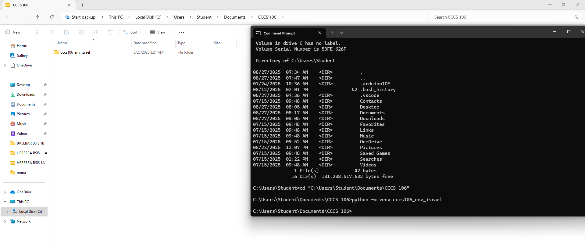

# Lab 1 Report: Environment Setup and Python Basics

**Student Name:** Renna M. Israel
**Student ID:** 231002318
**Section:** A
**Date:** August 27, 2025

## Environment Setup

### Python Installation
- **Python Version:** 3.13.0
- **Installation Issues:** While creating the vitrual environment, I encountered an "Access Denied" error because Windows restricted permission to write files in the selected folder. The issue was solved by running the cmd as administrator and ensuring I was inside my own course directory before creating the environment.
- **Virtual Environment Created:** ✅ cccs106_env_israel

### VS Code Configuration
- **VS Code Version:** 1.82.0
- **Python Extension:** ✅ Installed and configured
- **Interpreter:** ✅ Set to cccs106_env_israel/Scripts/python.exe

### Package Installation
- **Flet Version:** 0.28.3
- **Other Packages:** None

## Programs Created

### 1. hello_world.py
- **Status:** ✅ Completed
- **Features:** Student info display, age calculation, system info
- **Notes:** My observations are the program runs successfully and displays the exact output. If there is a syntax error, the program won't run and will shows an error message.

### 2. basic_calculator.py
- **Status:** ✅ Completed
- **Features:** Basic arithmetic, error handling, min/max calculation
- **Notes:** My observation, the program correctly performs arithmetic operations and displays the expected resullt.

## Challenges and Solutions

The development of a simple calculating practice requires the solution of issues related to the processing of invalid data, an error about the division of zero and the correct display of the result of the correct number of places after the period. This may be resolved by adding input validation, exception handling and programming an output. There may also be some troubles such as Python not being recognized, errors with pip, access denied etc., during installation and setup. These problems can be overcome by proper installing of Python, adding it into PATH and upgrading pip, in addition to running the terminal with administrator rights as needed.

## Learning Outcomes

As a result of this lab exercise, I realized how to appropriately install a development environment (python, VS Code, and an environment to structure projects in form of virtual environment). I also came to know how to manage and install packages with the help of pip, which is very crucial when using external libraries. The practical exercise helped me have more insight about starting to program in Python by allowing me to understand how to print output, accept input, perform math operations as well as breaking down operations into the various branches of intelligence.

Also in writing the hello_world.py, basic_calculator.py and running programs, I realized the significance of proper syntax, error handling and program flow in delivering the correct output. I also understood the importance of expecting the potential mistakes, e.g. non-numeric values or division by zero, and giving useful feedback to the user. In general, the lab was effective in expanding my confidence in using Python as a programmer, in learning the tools required in software development, and in approaching problems by applying problem-solving techniques to solve technical problems.

## Screenshots

