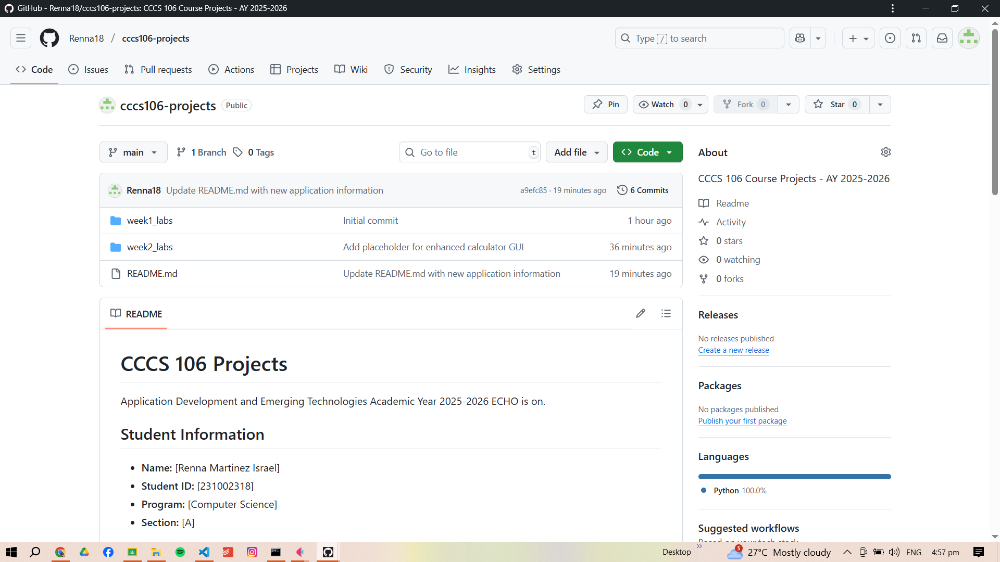
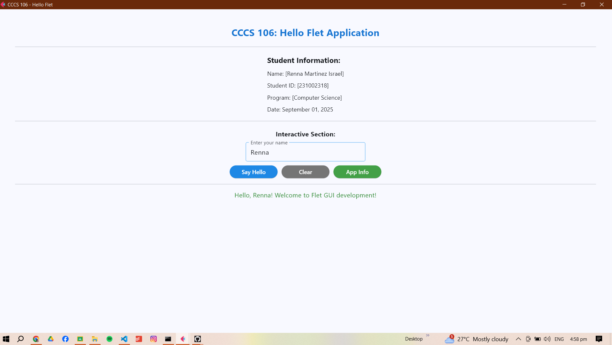
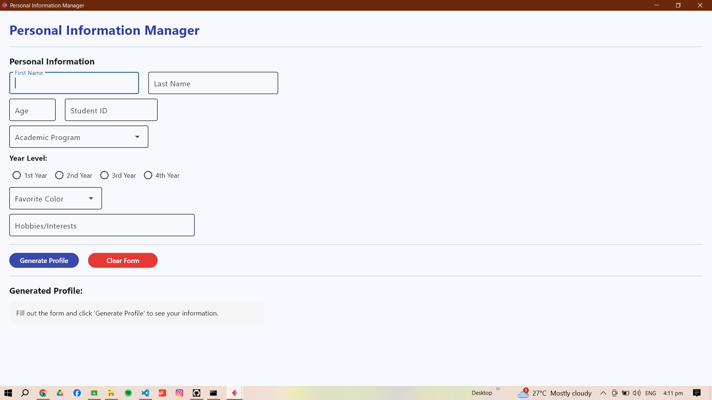
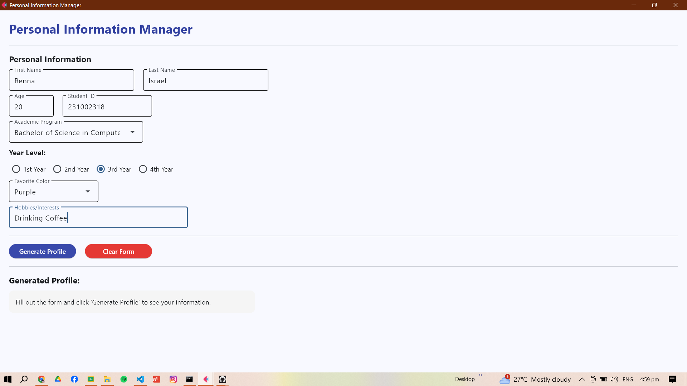
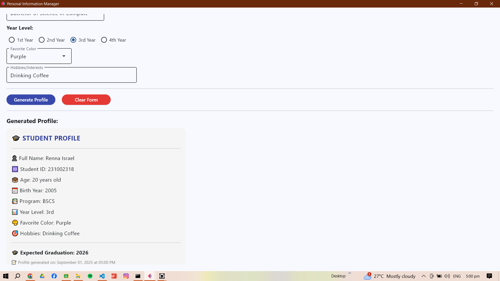

# Lab 2 Report: Git Version Control and Flet GUI Development

**Student Name:** Renna Martinez Israel
**Student ID:** 231002318
**Section:** A
**Date:** September 3,2025

## Git Configuration

### Repository Setup
- **GitHub Repository:** (https://github.com/Renna18/cccs106-projects)
- **Local Repository:** ✅ Initialized and connected
- **Commit History:** 6 commits with descriptive messages

### Git Skills Demonstrated
- ✅ Repository initialization and configuration
- ✅ Adding, committing, and pushing changes
- ✅ Branch creation and merging
- ✅ Remote repository management

## Flet GUI Applications

### 1. hello_flet.py
- **Status:** ✅ Completed
- **Features:** Interactive greeting, student info display, dialog boxes
- **UI Components:** Text, TextField, Buttons, Dialog, Containers
- **Notes:** 
   - Knows how to build Flet apps with current UI components.
   - Tried Dialog and Container layouts.
   - Messages are only shown after they have been checked by assuring the inputs.]

### 2. personal_info_gui.py
- **Status:** ✅ Completed
- **Features:** Form inputs, dropdowns, radio buttons, profile generation
- **UI Components:** TextField, Dropdown, RadioGroup, Containers, Scrolling
- **Error Handling:** Input validation and user feedback
- **Notes:** 
   - Learned to combine multiple UI components for a cohesive form
   - Managed scrollable content to handle longer forms
   - Practiced organizing layout with containers and spacing]

## Technical Skills Developed

### Git Version Control
- Understanding of repository concepts
- Basic Git workflow (add, commit, push)
- Branch management and merging
- Remote repository collaboration

### Flet GUI Development
- Flet 0.28.3 syntax and components
- Page configuration and layout management
- Event handling and user interaction
- Modern UI design principles

## Challenges and Solutions

One of the key issues that emerged in this activity was how to properly manage the Git workflow and ensure that all changes such as new branches and merged features were properly synchronized with the remote repository. Firstly, there were some issues with authentication and the naming of the branches, but after following the instructions closely and paying close attention to the URLs of the repositories, the problems were eliminated. In the Flet side, it needed the knowledge of how to combine various UI elements such as TextField, Dropdown, RadioGroup, and Containers with the required layout and scrollable space. There were also input validation and event handling issues which were addressed by adding checks before the messages are displayed, and also by making the feedback understandable by the user.

## Learning Outcomes

This activity provided me with a hands-on experience in version control as well as GUI development. I also got to learn the idea of creating a local Git repository, staging and committing changes, creating and merging feature branches, and interacting with GitHub, further solidifying the importance of formal workflows as part of a collaborative development process. I have also gained some practical experience in Flet GUI development, with interactive application construction, layout management, event handling and input validation. On the whole, this lab supported my ideas regarding the best practice of software development, version control and the development of modern GUIs, and the role of planning and testing in the development of applications.

## Screenshots

### Git Repository

### GUI Applications
- **Hello App**
  

- **Personal Info Form**
  

- **Profile Generated**
  

- **Info Screenshot**
  

## Future Enhancements

In the future, the applications can be improved and some new features can be added:

1. Improved UI/UX Design: Customize with your preferred themes, layouts, and visually attractive elements to make the user experience more pleasant.

2. Data Persistence: Add file storage or database (e.g. SQLite and JSON) to allow storing and retrieving user information and user profiles in the future.

3. Better validation: The form should have more strong validation rules, like email form validation or highlighting of a required field.

4. Export Functionality: enables users to save their generated profiles to PDF or text files so that they can share them easily.

5. Integration with Git: Automate screenshots or logs of the GUI apps so that they can be version-controlled to enable easier change tracking.
